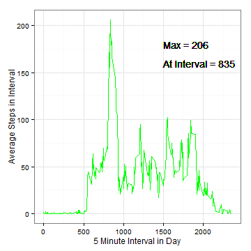

Reproducible Research Peer Assessment Assignment #1
========================================================

## Introduction

This is my submission for the Coursera Reporducible Research Peer
Assessment Assignment #1.  The goal is to create a report using
RMarkdown/knitr that answers the assigned questions.

## Loading and preprocessing the data

The data file is unzipped, loaded into R using read.csv, and the number of steps per day are summed by date or averaged by interval.


```r
if (!file.exists("./zipdir")) {
    dir.create("./zipdir")
}
unzip("./activity.zip", exdir = "./zipdir")
list.files("./zipdir")
alldata <- read.csv("./zipdir/activity.csv", header = TRUE)

sumdata <- aggregate(steps ~ date, data = alldata, sum, na.action = na.omit)
sumdata2 <- aggregate(steps ~ interval, data = alldata, mean, na.action = na.omit)
```


## What is mean total number of steps taken per day?

A histrogram of the total number of steps per day is plotted and the mean and median for this data are calculated.


```r
mn <- round(mean(sumdata$steps))
md <- round(median(sumdata$steps))

require(ggplot2)

p <- ggplot(sumdata, aes(x = steps))
p <- p + geom_histogram(fill = "red")
p <- p + theme_bw()
p <- p + labs(title = "Histogram of Total Steps per Day \n")
p <- p + geom_text(data = NULL, label = paste("Mean = ", mn, sep = ""), x = 14000, 
    y = 8, hjust = 0)
p <- p + geom_text(data = NULL, label = paste("Median = ", md, sep = ""), x = 14000, 
    y = 7, hjust = 0)
p <- p + xlab(label = "Steps per Day")
plot(p)
```

 


With the missing data ignored, the mean of the number of steps per day is 10766 and the median is 10765.


## What is the average daily activity pattern?

A line plot of the number of steps per time interval averaged over the two months is plotted.  The maximum average is determined and the interval that it corresponds to is reported.


```r
mx <- max(sumdata2$steps)
maxint <- sumdata2[sumdata2$steps == mx, "interval"]
p1 <- ggplot(sumdata2, aes(y = steps, x = interval))
p1 <- p1 + geom_line(color = "green", linetype = 1)
p1 <- p1 + xlab(label = "5 Minute Interval in Day")
p1 <- p1 + ylab(label = "Average Steps in Interval")
p1 <- p1 + geom_text(data = NULL, label = paste("Max = ", round(mx), sep = ""), 
    x = 1500, y = 180, hjust = 0)
p1 <- p1 + geom_text(data = NULL, label = paste("At Interval = ", maxint, sep = ""), 
    x = 1500, y = 160, hjust = 0)
p1 <- p1 + theme_bw()
plot(p1)
```

 


The interval with the maximum average steps is 835 and the maximum average is 206.2.

## Imputing missing values

The number of rows with missing values are determined.  These missing values are replaced with the average value for that time interval.  A histrogram of the new data is then plotted and the mean and median are reported.


```r
numberna <- length(is.na(alldata))
for (i in 1:nrow(alldata)) {
    d <- as.vector(subset(alldata, interval == alldata[i, "interval"], select = "steps"))
    dm <- mean(d$steps, na.rm = TRUE)
    alldata[i, "newsteps"] <- ifelse(is.na(alldata[i, "steps"]), dm, alldata[i, 
        "steps"])
}
sumdata3 <- aggregate(newsteps ~ date, data = alldata, sum, na.action = na.omit)
```


The number of rows with missing values is 52704.


```r
nmn <- round(mean(sumdata3$newsteps))
nmd <- round(median(sumdata3$newsteps))

require(ggplot2)

p2 <- ggplot(sumdata3, aes(x = newsteps))
p2 <- p2 + geom_histogram(fill = "red")
p2 <- p2 + theme_bw()
p2 <- p2 + labs(title = "Histogram of Total Steps per Day \n With NAs Replaced \n")
p2 <- p2 + geom_text(data = NULL, label = paste("Mean = ", nmn, sep = ""), x = 14000, 
    y = 8, hjust = 0)
p2 <- p2 + geom_text(data = NULL, label = paste("Median = ", nmd, sep = ""), 
    x = 14000, y = 7, hjust = 0)
p2 <- p2 + xlab(label = "Steps per Day")
plot(p2)
```

 


With the missing data replaced with the interval average, the mean of the number of steps per day is 10766 and the median is 10766.  Only the median has shifted slightly.

## Are there differences in activity patterns between weekdays and weekends?

Start by classifying the days as weekend or weekday:


```r
alldata$days <- weekdays(as.Date(alldata$date, "%Y-%m-%d"))
alldata$wday <- as.factor(ifelse(alldata$days %in% c("Saturday", "Sunday"), 
    "weekend", "weekday"))
sumdata3 <- aggregate(newsteps ~ interval + wday, data = alldata, mean, na.action = na.omit)
```


Then make a lineplot of the number of steps by interval, averaged across all weekday days or weekend days, split by weekend or weekday.


```r
require(gridExtra)
p3 <- ggplot(sumdata3, aes(y = newsteps, x = interval))
p3 <- p3 + geom_line(aes(color = wday), linetype = 1)
p3 <- p3 + xlab(label = "5 Minute Interval in Day")
p3 <- p3 + ylab(label = "Average Steps in Interval")
p3 <- p3 + facet_wrap(~wday, ncol = 1)
p3 <- p3 + theme_bw()
p3 <- p3 + theme(legend.position = "none", axis.text = element_text(size = rel(0.9)), 
    plot.margin = unit(c(3, 3, 1, 1), "lines"))
plot(p3)
```

 


